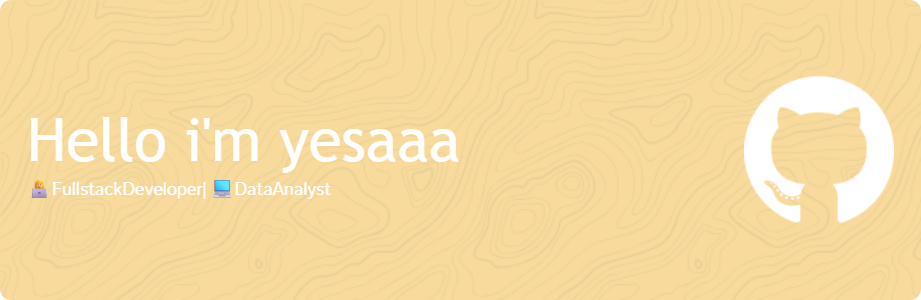

## Hello World!! i'm yesaaa👋

<!--
**yesaaa1711/yesaaa1711** is a ✨ _special_ ✨ repository because its `README.md` (this file) appears on your GitHub profile.

Here are some ideas to get you started:

- 🔭 I’m currently working on ...
- 🌱 I’m currently learning ...
- 👯 I’m looking to collaborate on ...
- 🤔 I’m looking for help with ...
- 💬 Ask me about ...
- 📫 How to reach me: ...
- 😄 Pronouns: ...
- ⚡ Fun fact: ...
-->

🎓 I'm an Informatics Engineering student who's currently exploring the world of **Fullstack Web Development** and **Data Analysis**.

💻 My journey just started, but I'm passionate about:
- 🌐 Building interactive and user-friendly web applications (Laravel, PHP, HTML/CSS)
- 📊 Analyzing data to uncover insights and support data-driven decisions (Python, Excel, SQL)

🌱 Currently learning:
- Laravel Framework 🛠️
- SQL for data analysis 📈
- Frontend + Backend skills for fullstack dev 💻

📚 I love exploring new tech, solving real-world problems with code, and turning ideas into digital solutions.

🧠 Always learning. Always curious. Always coding.

##### Skills
      

##### Connect with me

<picture>
  <source media="(prefers-color-scheme: dark)" srcset="https://raw.githubusercontent.com/yesaaa1711/yesaaa1711/output/pacman-contribution-graph-dark.svg">
  <source media="(prefers-color-scheme: light)" srcset="https://raw.githubusercontent.com/yesaaa1711/yesaaa1711/output/pacman-contribution-graph.svg">
  
</picture>

###